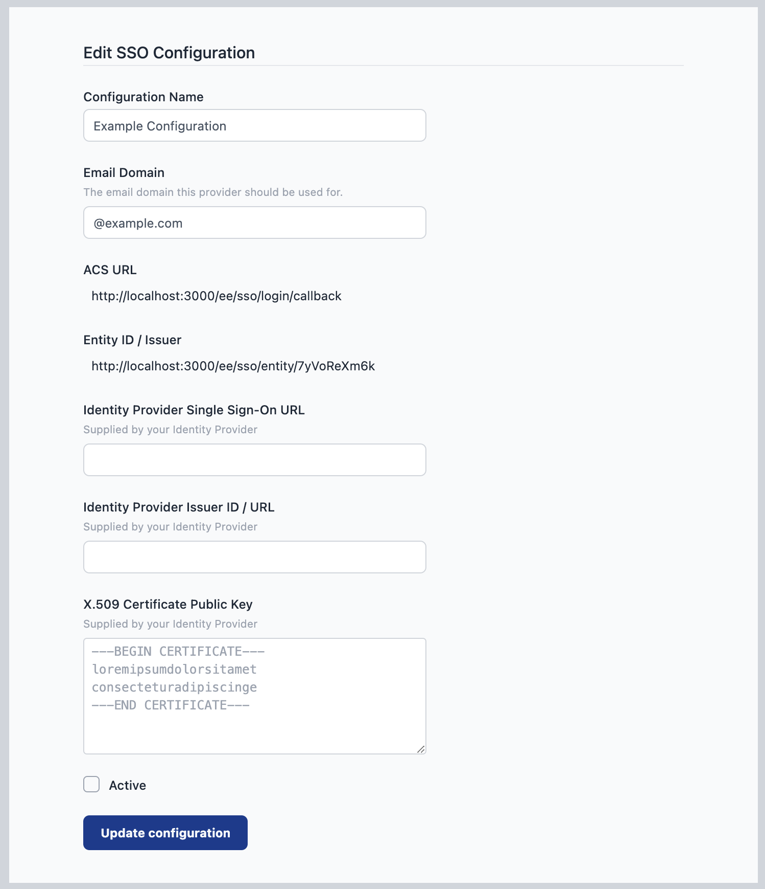

# SAML Single-Sign On

_This feature is only available on EE licensed instances of FlowFuse._

FlowFuse allows users to sign in through their SAML identity provider, such
as Google Workspace.

The platform can be configured with multiple SAML configurations and uses the
user's email domain to identify which identity provider should be used.

The user must already exist on the FlowFuse platform before they can sign in via SSO.

Once enabled for a particular email domain, regular users on that domain will be directed
to the Identity Provider in order to log in. They will no longer be able to log in with
their local password, nor will they be able to change their email address in User Settings.  

Admin users will still be able to log in with their original FlowFuse username/password - this ensures
they don't get locked out of the platform if there is a problem with the Identity
Provider configuration.

## Managing SAML SSO Configurations

The SAML SSO Configurations are managed by the platform Administrator under the
`Admin Settings > Settings > SSO` section.

To fully configure SAML SSO, you will need to generate a configuration in FlowFuse,
provide some of the generated values to your Identity Provider, and copy back some
values they provide.

### Create a SAML SSO Configuration

1. Click 'Create SSO SAML Configuration' to create a new config

   

2. Give the configuration a name to help identify it, and provide the email domain
   name this configuration should apply to.

3. Click 'Create configuration'

   At this point, the configuration has been created and metadata generated for the
   configuration, but it is not active.

   

4. Copy the `ACS URL` and `Entity ID / Issuer` values as you will need to configure
   your Identity Provider with these values.

You can save the configuration at any time by clicking the `Update configuration`
button. The configuration will only be enabled when you tick the `active` checkbox
and save the changes.

### Configure your Identify Provider

Every Identity Provider uses slightly different terminology and varies what
information they require and what they provide. This can make it a tricky task
to complete.

We provide specific guides for the providers we have verified below.

If you have a working configuration for a provider not listed here, please do
share the details so we can add them to the list.

The general points are:

1. Your Identity Provider will supply you with some of the following values that
   should be entered into your FlowFuse SAML SSO Configuration:

    - `Single Sign-On URL` - also referred to as 'SAML Endpoint', 'Login URL' or 'IdP SSO URL'.
    - `Issuer ID / URL`
    - `X.509 Certification Public Key` - the public key of a certificate used to sign
      SAML requests.

2. Configure the `NameID` SAML option to be `EmailAddress` and have it return the email
   of the user logging in. This is how FlowFuse will verify they are a known user
   on the platform.

### Enable your SAML SSO Configuration

Once you have setup both sides of the configuration you can enable it for use
by ticking the `active` checkbox and clicking `Update configuration`.

## Providers

The following is a non-exhaustive list of the providers that are known to work
with FlowFuse SAML SSO.

 - [Azure AD](#azure-ad)
 - [Google Workspace](#google-workspace)
 - [OneLogin](#onelogin)

### Azure AD

Microsoft provide a guide for creating a custom SAML Application [here](https://learn.microsoft.com/en-us/azure/active-directory/manage-apps/add-application-portal).

The following table maps the Azure terminology to the FlowFuse settings.

FlowFuse Setting | Azure Setting
----|----
`ACS URL` | `Reply URL (Assertion Consumer Service URL)`
`Identity Provider Single Sign-On URL` | `App Federation Metadata Url`
`Identity Provider Issuer ID / URL` | `Entity ID`
`X.509 Certificate Public Key` | `Certificate (Base64)`

Within the `SAML Signing Certificate` configuration, the `Signing Option` must be set to `Sign SAML response and assertion`.

### Google Workspace

Google provide a guide for creating a custom SAML Application [here](https://support.google.com/a/answer/6087519?hl=en).

Google Workspace only supports HTTPS-based SSO URLs. You cannot use it when developing
locally using `http://localhost:3000`.

The following table maps the Google Workspace terminology to the FlowFuse settings.

FlowFuse Setting | Google Workspace Setting
----|----
`Identity Provider Single Sign-On URL` | `SSO URL`
`Identity Provider Issuer ID / URL` | `Entity ID`
`X.509 Certificate Public Key` | `Certificate`

Within the `Service provider details` configuration, the `Signed response` option must be enabled.

### OneLogin

Follow [this guide](https://onelogin.service-now.com/support?id=kb_article&sys_id=93f95543db109700d5505eea4b96198f) 
to create a `OneLogin SAML Test Connector`.

FlowFuse Setting | OneLogin Setting
----|----
`Identity Provider Single Sign-On URL` | `SAML 2.0 Endpoint (HTTP)`
`Identity Provider Issuer ID / URL` | `Issuer URL`
`X.509 Certificate Public Key` | `X.509 Certificate`
