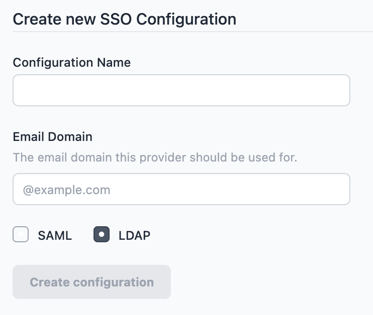

# Configuring LDAP based Single Sign-On

_This feature is only available on self-hosted Enterprise licensed instances of FlowFuse._

The SSO Configurations are managed by the platform Administrator under the
`Admin Settings > Settings > SSO` section.

The user must already exist on the FlowFuse platform before they can sign in via SSO.

### Create a SSO Configuration

1. Click 'Create SSO Configuration' to create a new config

   

2. Give the configuration a name to help identify it, and provide the email domain
   name this configuration should apply to. Ensure the LDAP option is selected - this
   cannot be changed after the configuration is created.

3. Click 'Create configuration'

   At this point, the configuration has been created and metadata generated for the
   configuration, but it is not active.

### Configuration LDAP

The following fields are provided for configuring LDAP. You will need to refer to
your LDAP service provider details for the correct values to enter:

   

 - `Server` - the address of the LDAP server, including port number.
 - `Username` - the bind DN to use to connect to the server. The user must have
   permission to lookup users in the directory.
 - `Password` - the password to connect to the server with.
 - `Base DN` - the base object under which user searches are performed.
 - `User Search Filter` - the filter used to search for a user. See below for more details.
 - `Enable TLS` - whether to use TLS for the LDAP connection
   - `Verify Server Certificate` - when TLS is enabled, whether to perform strict certification
     validation.

You can save the configuration at any time by clicking the `Update configuration`
button. The configuration will only be enabled when you tick the `active` checkbox
and save the changes.

#### User Search Filter

The search filter is used when checking if a user exists within the directory, using
the standard LDAP query notation. The default search filter is `(uid=${username})`.

The platform will replace `${username}` and `${email}` with the user's details when
they attempt to login.

## Creating new users

With FlowFuse 2.7, the SSO Configuration now includes an option to automatically
register users who sign in via the configuration.

This option is not enabled by default, but can be enabled but selecting the `Allow Provisioning of New Users on first login`
option in the SOO configuration.

When creating the user, the platform will use information provided by the LDAP provider
to create the username. The user will be directed to their settings page where they
can modify their user details to their preferred values.

## Managing Team Membership with LDAP Groups

LDAP implementations can also be used to group users

To enable this option, select the `Manage roles using group assertions` in the SSO configuration.

The following configuration options should then be set:

- `Group DN` - this is the base DN to be used to search for group membership.
- `Team Scope` - this determines what teams can be managed using this configuration. There are two options:
     - `Apply to all teams` - this will allow the SAML groups to manage all teams on the platform. This is
       suitable for a self-hosted installation of FlowFuse with a single SSO configuration for all users on
       the platform.
     - `Apply to selected teams` - this will restrict what teams can be managed to the provided list. This
       is suitable for shared-tenancy platforms with multiple SSO configurations for different groups of users,
       such as FlowFuse Cloud.
       When this option is selected, an additional option is available - `Allow users to be in other teams`. This
       will allow users who sign-in via this SSO configuration to be members of teams not in the list above.
       Their membership of those teams will not be managed by the SSO groups.
       If that option is disabled, then the user will be removed from any teams not in the list above.

### LDAP Groups configuration

A user's team membership is managed by what groups they are in. When the user logs in, the LDAP provider
will be queried for a list of groups they are a member of. This can be either as a `member` or `uniqueMember` of a `groupOfNames` or `groupOfUniqueNames` respectively.

The group name is used to identify a team, using its slug property, and the user's role in the team.
The name must take the form `ff-<team>-<role>`. For example, the group `ff-development-owner` will
container the owners of the team `development`.

The valid roles for a user in a team are:
 - `owner`
 - `member`
 - `viewer`
 - `dashboard`

*Note*: this uses the team slug property to identify the team. This has been chosen to simplify managing
the groups in the LDAP Provider - rather than using the team's id. However, a team's slug can be changed
by a team owner. Doing so will break the link between the group and the team membership - so should only
be done with care.

If group naming policy doesn't allow this exact format, a prefix and suffix can be applied and the length 
of these additions can be added to the SSO configuration so they can be removed. e.g. with a prefix and 
suffix length of 5 the following group name will work:

- `test_ff-development-owner_test`

## Managing Admin users

The SSO Configuration can be configured to manage the admin users of the platform by enabling the
`Manage Admin roles using group assertions` option. Once enabled, the name of a group can be provided
that will be used to identify whether a user is an admin or not.

**Note:* the platform will refuse to remove the admin flag from a user if they are the only admin
on the platform. It is *strongly* recommended to have an admin user on the system that is not
managed via SSO to ensure continued access in case of any issues with the SSO provider.

## Providers

The following is the node-exhaustive list of the providers that are known to work with FlowFuse LDAP SSO.

- [OpenLDAP](https://www.openldap.org/)
