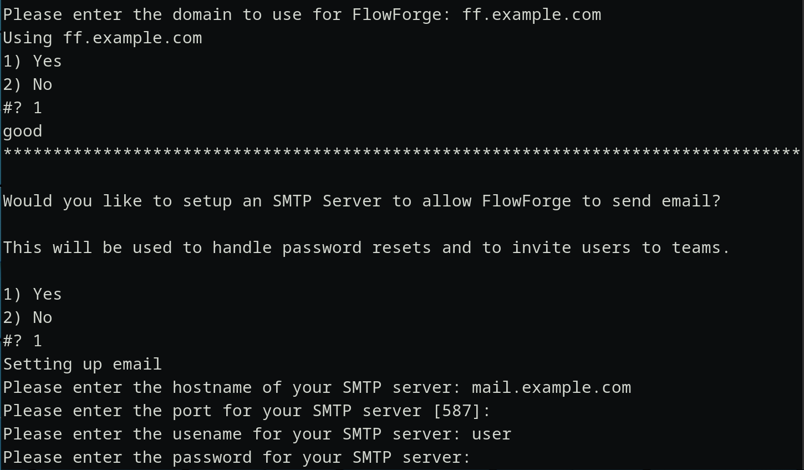

# Installing FlowFuse from AWS Market Place

## Prerequisites

### DNS

To make use of the AWS Machine image you will need a DNS Domain to host both the FlowForge application and the Node-RED instances you create. 

For example if you use `ff.example.com` then the FlowFuse application will run on `https://forge.ff.example.com` and Node-RED would be on `https://[instance-name].ff.example.com`.

You will need to set up a wildcard DNS entry that points the whole domain to the Public IP address of the Droplet.

```
*.ff.example.com 3600 A xxx.xxx.xxx.xxx
```

The Public IP address of the EC2 machine will be listed in the AWS Console once it has started and at the start of the Setup Wizard when you first SSH into the machine.

### SMTP Server (Optional)

This is used to send invites to new user and to enable password resets.

You will need to know the following:

- SMTP Server hostname
- Port (Default 587)
- Username/Password

If you don't already have a SMTP server you can grab one from an email delivery service like SparkPost, Sendgrid, Mailgun, etc.

## Setup

After the EC2 Machine has been created and you have set up the DNS entry you will need to connect to the machine to and enter the domain name 

You can do this in 2 ways

1. With SSH, either using keys or password depending on what Authentication mechanism you picked at creation time
    ```
    ssh -i aws-ssh.pem ubuntu@xxx.xxx.xxx.xxx
    ```

2. Using the "Connect" button on the EC2 console.
     

Once logged in you will be presented with a wizard to set the domain and confirm by entering `1` or `2` to enter the domain again.


The wizard will then ask about setting up a SMTP server to allow FlowForge to send email. This used to invite users or reset passwords, 
it is optional.



The wizard will then update the configuration files and start FlowForge


It will then present a link to complete setup in the browser and a Username and Password to log in as the default admin user. You will be asked to change the password when you use it for the first time.

You can now close the console connection to the droplet.

Details of how to complete this steps are [here](../first-run.md)

## Upgrade

You can follow the normal FlowForge Docker [upgrade instructions](./README.md#upgrade), the install directory is `/opt/flowforge` 