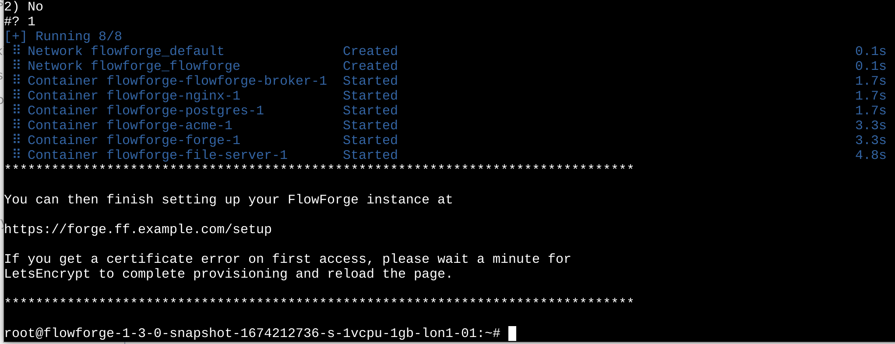

# 1-Click Digital Ocean Droplet Install

We have packaged the Docker Compose build of FlowForge as a Digital Ocean Droplet. It can be found in the Digital Ocean Market Place [here](https://marketplace.digitalocean.com/apps/flowforge?refcode=fb23e438a477&action=deploy) 

## Prerequisites

### DNS

To make use of this Droplet you will need a DNS Domain to host both the FlowForge application and the Projects you create. 

For example if you use `ff.example.com` then the FlowForge application will run on `https://forge.ff.example.com` and a project would be on `https://[project-name].ff.example.com`.

You will need to set up a wildcard DNS entry that points the whole domain to the Public IP address of the Droplet.

```
*.ff.example.com 3600 A xxx.xxx.xxx.xxx
```

The Public IP address of the Droplet will be listed in the UI when it has been created


## Setup

After the Droplet has been created and you have set up the DNS entry you will need to connect to the droplet to and enter the domain name 

You can do this in 2 ways

1. With SSH, either using keys or password depending on what Authentication mechanism you picked at creation time
    ```
    ssh -i digtial-ocean-ssh.key root@xxx.xxx.xxx.xxx
    ```
2. Opening a Console from the Web Interface
    

Once logged in you will be presented with a wizard to set the domain and confirm by entering `1` or `2` to enter the domain again.


The wizard will then update the configuration files and start FlowForge



It will then present a link to complete setup in the browser. You can now close the console connection to the droplet.

Details of how to complete this steps are [here](../first-run)