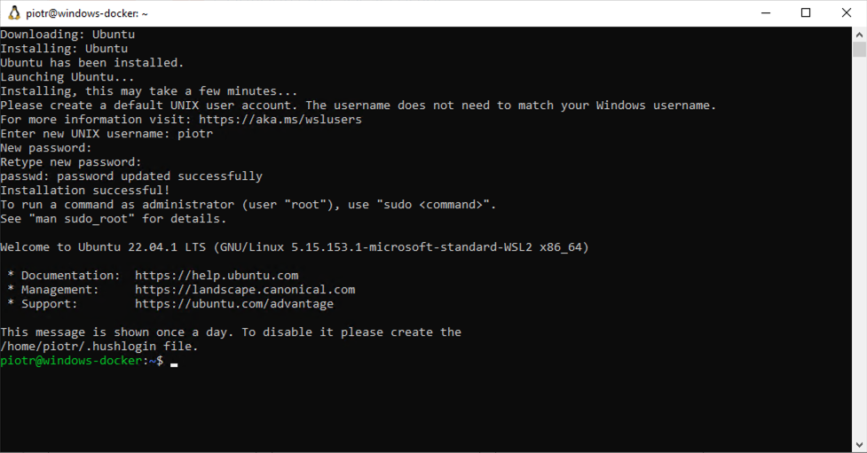

# How to Install Docker Engine (Docker CE) on Windows using WSL2

We recommend running FlowFuse Docker on Linux when ever possible as containers are inherently a Linux technology. If that really is not possible in your environment and the base OS must be Windows then the next best option is to use the WSL2 (Windows Subsystem for Linux v2) feature of Windows.

## Prerequisites

Ensure your system meets the following Windows Subsystem for Linux v2 requirements:

- Windows Server 2022
- Windows 10 version 2004 and higher (Build 19041 and higher)
- Windows 11

## Step 1: Install Windows Subsystem for Linux 

Open PowerShell as an administrator and run the following commands:

1. Install WSL and the default Linux distribution (Ubuntu) using the following command:
   ```powershell
   wsl --install
   ```

2. Reboot your system to apply changes
   ```powershell
   shutdown -r -t 5
   ```

  After the reboot, WSL will automatically start installing the Ubuntu Linux distribution.
   You will be prompted to create a new UNIX account. Follow the instructions to create a new user account and set a password.
   

   Once completed, you will be dropped into a new Ubuntu shell.
   

3. Confirm using proper WSL version, by running (in Powershell window):
   ```powershell
   wsl --status
   ```

## Step 2: Install Docker on Ubuntu

Once the Ubuntu system is ready, follow these steps to install Docker:

1. **Remove Conflicting Packages**

   First, remove any existing Docker packages that might conflict with the installation:

   ```bash
   for pkg in docker.io docker-doc docker-compose docker-compose-v2 podman-docker containerd runc; do sudo apt-get remove $pkg; done
   ```

2. **Add Docker’s Official GPG Key and APT Repository**

   Next, update your package list and add Docker's official GPG key and APT repository:

   ```bash
   sudo apt-get update
   sudo apt-get install ca-certificates curl
   sudo install -m 0755 -d /etc/apt/keyrings
   sudo curl -fsSL https://download.docker.com/linux/ubuntu/gpg -o /etc/apt/keyrings/docker.asc
   sudo chmod a+r /etc/apt/keyrings/docker.asc
   ```

   Add the Docker repository to your APT sources:

   ```bash
   echo \
     "deb [arch=$(dpkg --print-architecture) signed-by=/etc/apt/keyrings/docker.asc] https://download.docker.com/linux/ubuntu \
     $(. /etc/os-release && echo "$VERSION_CODENAME") stable" | \
     sudo tee /etc/apt/sources.list.d/docker.list > /dev/null
   sudo apt-get update
   ```

3. **Install Docker Packages**

   Now, install Docker and its associated packages:

   ```bash
   sudo apt-get install docker-ce docker-ce-cli containerd.io docker-buildx-plugin docker-compose-plugin
   ```

4. **Start the Docker Service**

   Start Docker using the following command:

   ```bash
   sudo /etc/init.d/docker start
   ```

5. **Verify Docker Installation**

   Run a test Docker container to verify that Docker is installed and running correctly:

   ```bash
   sudo docker run hello-world
   ```

   If Docker is installed correctly, you should see a similar output:

   


Once Docker is installed, you can [install the FlowFuse platform using docker compose](./README.md).


## Optional: Port Forwarding from External IP Address to Docker Container

If you want to forward a port from your external IP address to a Docker container, follow these additional steps.

Consider a scenario where you want to run an Nginx container:

1. **Run the Nginx Container**

   In the Linux shell, start the Nginx container, binding port 8080 on your localhost to port 80 in the container:

   ```bash
   sudo docker run -d -p 8080:80 --name mynginx nginx
   ```

2. **Set Up Port Forwarding**

   To forward traffic from an external IP to your container, run the following PowerShell command (administrator privileges required):

   ```powershell
   netsh interface portproxy add v4tov4 listenport=8080 listenaddress=0.0.0.0 connectport=8080 connectaddress=127.0.0.1
   ```
   
   This command forwards traffic from port 8080 on your external IP address to port 8080 on your localhost, where the Nginx container is listening for connections.
   The value for `listenport` can be changed as needed.

3. **Open the Port on Your Firewall**

   Ensure that port 8080 (or any other port you specivied as a value for `listenport` in the previous step) is open on your firewall:

   ```powershell
   New-NetFireWallRule -DisplayName 'WSL 8080TCP' -Direction Inbound -LocalPort 8080 -Action Allow -Protocol TCP
   New-NetFireWallRule -DisplayName 'WSL 8080TCP' -Direction Outbound -LocalPort 8080 -Action Allow -Protocol TCP
   ```

4. **Access the Nginx Container** 

   You can now access the Nginx container by visiting `http://<server-external-ip>:8080` in your browser.
