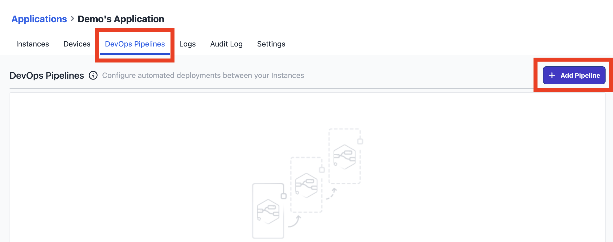
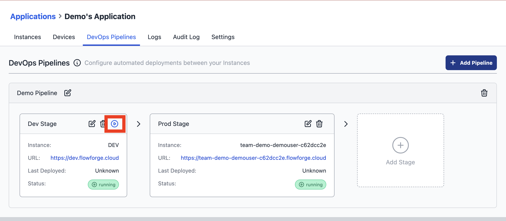

# Getting Started with FlowFuse

This guide will help you learn how to use the FlowFuse platform to quickly create new Node-RED applications after a successful [installation](/docs/install/introduction.md) or [sign-up](https://app.flowforge.com/account/create) for FlowFuse Cloud.

## Creating a Node-RED Instance

1. **Automatic Creation**: Your first Node-RED instance should be automatically created upon your initial login to FlowFuse. To access the Node-RED Editor, simply click on `Open Editor`.

    

2. **Additional Instance**: For utilizing various other FlowFuse features (e.g., DevOps Pipelines), it's highly beneficial to create a second Node-RED instance. A second Node-RED instance is included in both our Starter Tier and the Trial Phase of FlowFuse Cloud. To do so, select your application— in our example, "Demo's Application"— and click `Add Instance`.

    

[Learn more about Instances](#working-with-instances)

## Creating Your First Flow

If you are already familiar with Node-RED, you can [skip this section](#creating-your-first-devops-pipeline).

1. **Access the Node-RED Editor**.

2. **Add an Inject Node**: The Inject node allows you to manually or automatically inject messages into a flow. Drag one onto the workspace from the palette. After adding, you can review its properties in the Information sidebar.

3. **Add a Debug Node**: The Debug node will display messages in the Debug sidebar. By default, it displays only the payload of the message.

4. **Wire Them Together**: Connect the Inject and Debug nodes by dragging from the output port of one to the input port of the other.

5. **Deploy**: At this stage, the nodes exist only in the editor. Click the Deploy button to implement them on the server.

6. **Inject**: With the Debug sidebar tab selected, click the Inject button (next to your Inject node). You should see numbers appear in the sidebar. By default, the Inject node uses milliseconds since January 1st, 1970, as its payload.

7. **Add a Function Node**: This allows you to modify messages using JavaScript.

    - Delete the existing wire (select it and press Delete).
    - Insert a Function node between the Inject and Debug nodes.
    - Double-click the Function node to access the edit dialog. Paste the following code:

    ```javascript
    // Create a Date object from the payload
    var date = new Date(msg.payload);
    // Format the payload as a Date string
    msg.payload = date.toString();
    // Return the modified message
    return msg;
    ```
    - Click Done, and then Deploy.

Now, when you click the Inject button, the messages in the sidebar will display as formatted, readable timestamps.

[Learn more about Flow creation](https://nodered.org/docs/user-guide/editor/)

## Creating Your First DevOps Pipeline

DevOps Pipelines enable you to link multiple Node-RED instances together in a deployment pipeline.

1. **Add a Pipeline**: Select your application and click `Add Pipeline`.

    

2. **Name Your Pipeline**: Enter a suitable name.

3. **Add Stages**: You can now add stages to your pipeline. In our example, we add a Development Stage and a Production Stage.

4. **Execute the Pipeline**: It is now easy to execute the pipeline with one click, promoting your recently created flow to your Production Node-RED instance.

    

[Learn more about DevOps Pipelines](./devops-pipelines.md)

## Working with Devices 

FlowFuse supports managing Node-RED on your own hardware.

 - [Getting started with Devices](../device-agent/introduction.md)

## Working with Teams

 - [Team management](./team/) - How to add and remove users from a team.
 - [Role based access control](./team/#role-based-access-control) - Which privileges are granted to different roles.

## Working with Files and Context

FlowFuse supports reading and writing persistent files and persistent context.

 - [Working with Files](filenodes.md)
 - [Working with Context](persistent-context.md)

 ## Working with Instances

 - [Snapshots](snapshots.md) - Create point-in-time backups of your Node-RED instances.
 - [Environment Variables](envvar.md) - How to manage Environment Variables in your Node-RED instances.
 - [Change Project Stack](changestack.md) - How to change an instance stack, for example to upgrade Node-RED.
 - [Logs](logs.md) - The Logs available in the FlowFuse application.
 - [Project Link Nodes](projectnodes.md) - Custom nodes for sending messages between Node-RED instances and devices.
 - [Instance Settings](instance-settings.md) - Settings available for Node-RED instances.
 - [Shared Team Library](shared-library.md) - Share flows easily between different Node-RED instances in your team.
 - [Node-RED Tools Plugin](/docs/migration/node-red-tools.md) - A plugin for Node-RED that lets you work with your flows outside of FlowFuse.
 - [High Availability mode](high-availability.md) - Run multiple copies of your instance for scaling and availability.