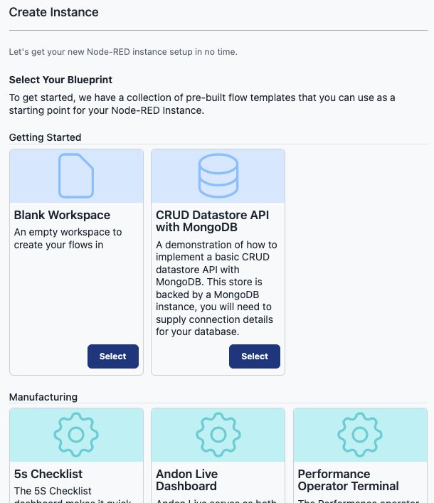
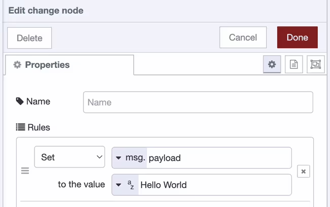
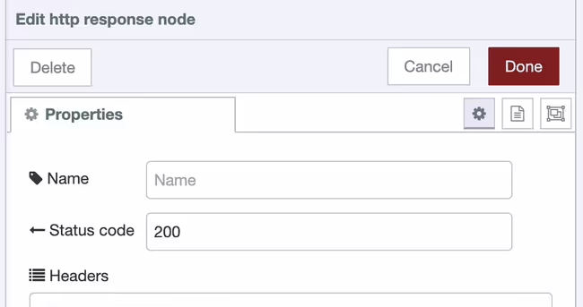

# Getting Started with FlowFuse

This guide will help you learn how to use the FlowFuse platform to quickly create new Node-RED applications after a successful [installation](/docs/install/introduction.md) or [sign-up](https://app.flowforge.com/account/create) for FlowFuse Cloud.

## Creating a Node-RED Instance

1. **Automatic Creation**: Your first Node-RED instance should be automatically created upon your initial login to FlowFuse. To access the Node-RED Editor, simply click on `Open Editor`.

    

2. **Additional Instance**: For utilizing various other FlowFuse features (e.g., DevOps Pipelines), it's highly beneficial to create a second Node-RED instance. A second Node-RED instance is included in both our Starter Tier and the Trial Phase of FlowFuse Cloud. To do so, select your application— in our example, "Demo's Application"— and click `Add Instance`.

    

[Learn more about Instances](#working-with-instances)

3. **Blueprint selection**: When creating a new Node-RED instance, you have the option to choose a blueprint tailored for specific use cases. For example, our "ANDON Operator Terminal" blueprint can be selected, and it will automatically configure the Node-RED instance, sparing you the need to start from scratch. While these templates are powerful out-of-the-box, they're also fully customizable, allowing you to tweak them to suit your unique requirements. Ultimately, blueprints speed up the learning curve for new users and expedite the solution-building process for experienced ones.

NOTE: _Some blueprints may only be available on certain tiers_

## Creating Your First Flow

If you are already familiar with Node-RED, you can [skip this section](#creating-your-first-devops-pipeline).

1. **Access the Node-RED Editor**.

2. **Add Nodes**: Drag an "http in" node into the editor. This node will listen for incoming HTTP requests. Next, drag in the "change" and the "http response" nodes. 

3. **Connect Nodes**: Connect the "http in" node to the "change" node, and then the "change" node to the "http response" node. Your flow should look like this:

    

4. **Configure 'http in' Node**: Double-click on the "http in" node to open its properties. Set the URL to "/hello" and the method to "GET".

5. **Configure 'change' Node**: Double-click the "change" node. Add "Hello World" to the field that says "to the value".

    

6. **Configure 'http response' Node**: Double-click to open its properties. Set the "Status Code" to be 200.

    

7. **Deploy**: Now that we have our flow set up, we can deploy it by clicking the "Deploy" button in the top right corner of the editor. Once the flow is deployed, you can test it by opening up a web browser, take the URL of your Instance and add "/hello" to the end, it should looks something like this `https://your-project.flowforge.cloud/hello`. You should see "Hello World!" displayed in the browser.

[Learn more about Flow creation](https://flowfuse.com/blog/2023/01/getting-started-with-node-red/#first-flow)

## Creating Your First DevOps Pipeline

DevOps Pipelines enable you to link multiple Node-RED instances together in a deployment pipeline.

1. **Add a Pipeline**: Select your application and click `Add Pipeline`.

    

2. **Name Your Pipeline**: Enter a suitable name.

3. **Add Stages**: You can now add stages to your pipeline. In our example, we add a Development Stage and a Production Stage.

4. **Execute the Pipeline**: It is now easy to execute the pipeline with one click, promoting your recently created flow to your Production Node-RED instance.

    

[Learn more about DevOps Pipelines](devops-pipelines.md)

## Working with Devices 

FlowFuse supports managing Node-RED on your own hardware.

 - [Getting started with Devices](/docs/device-agent/introduction.md)

## Working with Teams

 - [Team management](/docs/user/team/README.md) - How to add and remove users from a team.
 - [Role based access control](/docs/user/team/README.md#role-based-access-control) - Which privileges are granted to different roles.

## Working with Files and Context

FlowFuse supports reading and writing persistent files and persistent context.

 - [Working with Files](/docs/user/filenodes.md)
 - [Working with Context](/docs/user/persistent-context.md)

 ## Working with Instances

 - [Snapshots](/docs/user/snapshots.md) - Create point-in-time backups of your Node-RED instances.
 - [Environment Variables](/docs/user/envvar.md) - How to manage Environment Variables in your Node-RED instances.
 - [Change Project Stack](/docs/user/changestack.md) - How to change an instance stack, for example to upgrade Node-RED.
 - [Logs](/docs/user/logs.md) - The Logs available in the FlowFuse application.
 - [Project Link Nodes](/docs/user/projectnodes.md) - Custom nodes for sending messages between Node-RED instances and devices.
 - [Instance Settings](/docs/user/instance-settings.md) - Settings available for Node-RED instances.
 - [Shared Team Library](/docs/user/shared-library.md) - Share flows easily between different Node-RED instances in your team.
 - [Node-RED Tools Plugin](/docs/migration/node-red-tools.md) - A plugin for Node-RED that lets you work with your flows outside of FlowFuse.
 - [High Availability mode](/docs/user/high-availability.md) - Run multiple copies of your instance for scaling and availability.