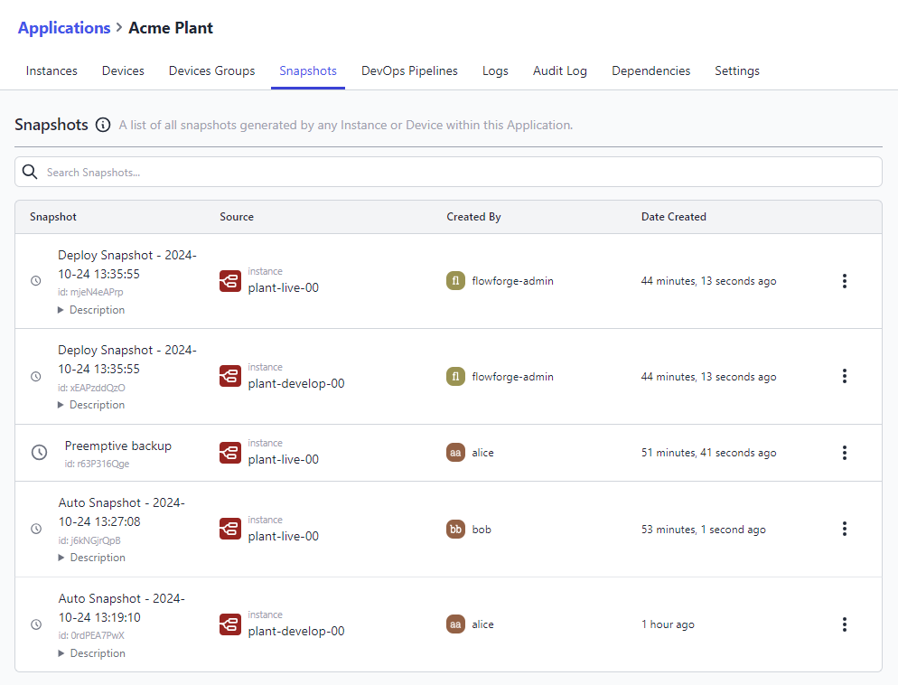
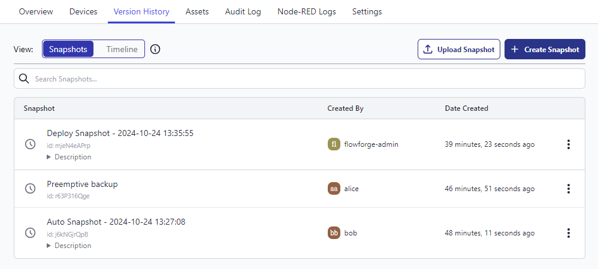
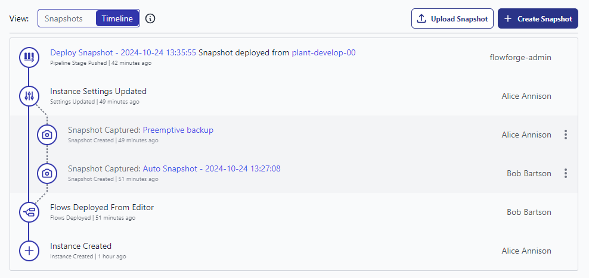
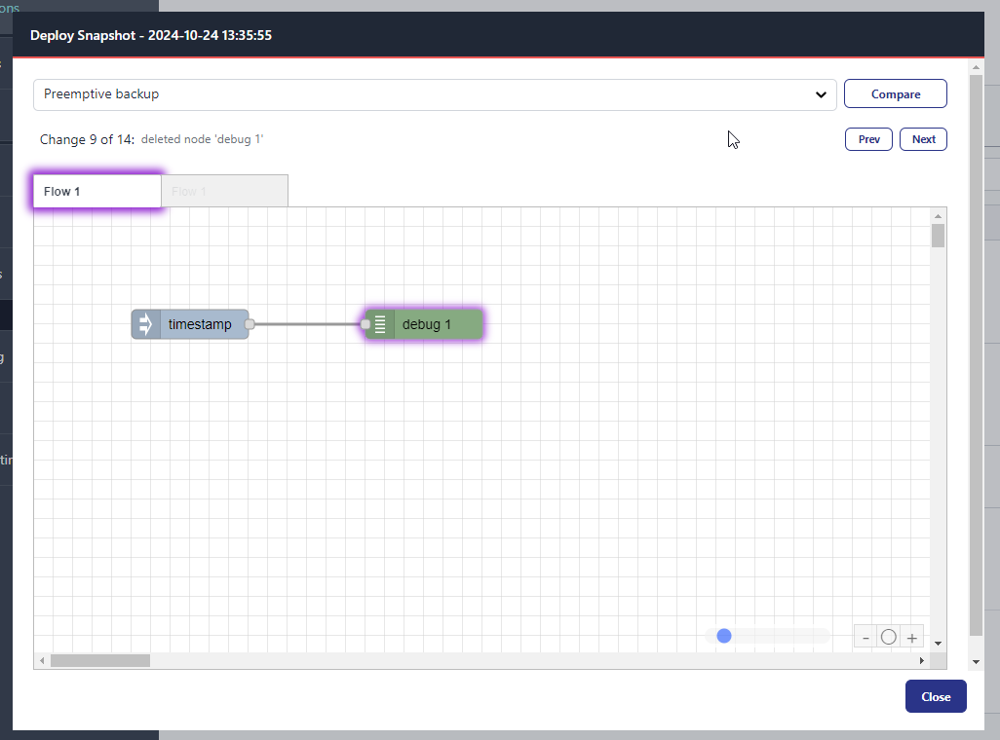

# Snapshots

## Introduction
A Snapshot is a point-in-time backup of a Node-RED instance. It captures:
1. The flows
2. Credentials
3. Environment variables
4. NPM packages, with locked versions
5. Runtime settings.

## In this document
- [Application Snapshots Overview](#application-snapshots-overview) - An overview of all snapshots belonging to an application and the available actions
- [Instance Snapshots Overview](#instance-snapshots-overview) - An overview of all snapshots belonging to an instance
   - [Snapshots](#snapshot-list) - A list of all snapshots belonging to an instance and the available actions
   - [Timeline](#timeline-view) - A visual timeline of instance changes and snapshots interleaved
- [Device Snapshots Overview](#device-snapshots-overview) - An overview of all snapshots belonging to a device and the available actions
- [Create a snapshot](#create-a-snapshot) - Create a snapshot of a device or an instance
- [Restore Snapshot](#restore-a-snapshot) - Apply a snapshot to the runtime of a device or an instance
- [Edit a snapshot](#edit-a-snapshot) - Edit the name and description of a snapshot
- [Upload a snapshot](#upload-a-snapshot) - Upload a snapshot to a device or an instance
- [Download a snapshot](#download-a-snapshot) - Download a snapshot to your local machine
- [Delete a snapshot](#delete-a-snapshot) - Delete a snapshot
- [Set Device Target (instance)](#Instance-owned-devices) - Set a snapshot as the target for all devices belonging to an instance
- [Creating a Snapshot from a device](#creating-a-snapshot-from-a-device) - Create a snapshot from the device overview page
- [Creating a Snapshot from within a device](#creating-a-snapshot-locally) - Create a snapshot from within Node-RED
- [Auto Snapshots](#auto-snapshots) - Automatically create snapshots when flows are deployed
- [Previewing Snapshots](#previewing-snapshots) - Preview the flows of a snapshot

## Snapshot Views:

### Application Snapshots Overview

All snapshots belonging to the instances and devices of an application are gathered and presented in a single list where you can perform the following actions:

- [Edit a snapshot](#edit-a-snapshot) - Edit the name and description of a snapshot
- [View Snapshot](#previewing-snapshots) - Preview the flows of a snapshot
- [Compare Snapshot](#compare-snapshots) - Compare the snapshot with another snapshot
- [Download Snapshot](#download-a-snapshot) - Download the snapshot to your local machine
- [Delete Snapshot](#delete-a-snapshot) - Delete the snapshot

_Screenshot showing Applications Snapshot list_

### Instance Snapshots Overview

Snapshots belonging to an instance are presented as a list or a visual timeline:

#### Snapshot List

Snapshots belonging to an instance are gathered and presented in a single list where you can perform the following actions:
- [Upload Snapshot](#upload-a-snapshot) - Upload a snapshot to the instance
- [Create Snapshot](#create-a-snapshot) - Create a snapshot of the instance
- [Restore Snapshot](#setting-a-device-target-snapshot) - Restore the snapshot to the instance
- [Edit Snapshot](#edit-a-snapshot) - Edit the snapshot name and description
- [View Snapshot](#previewing-snapshots) - Preview the snapshot flows
- [Compare Snapshot](#compare-snapshots) - Compare the snapshot with another snapshot
- [Download Snapshot](#download-a-snapshot) - Download the snapshot to your local machine
- [Set as Device Target](#setting-a-device-target-snapshot) - Set the snapshot as the device target snapshot
- [Delete Snapshot](#delete-a-snapshot) - Delete the snapshot

_Screenshot showing Instance Snapshot list_

#### Timeline View

The timeline view shows a visual representation of changes made to an instance with
available snapshots interleaved to signify when they were created.

Any snapshots displayed inline on the timeline will have the same actions available as in the Snapshot List view above.

_Screenshot showing Instance Visual Timeline_

### Device Snapshots Overview

Snapshots belonging to a device are presented in a single list where you can perform the following actions:
- [Upload Snapshot](#upload-a-snapshot) - Upload a snapshot to the instance
- [Create Snapshot](#create-a-snapshot) - Create a snapshot of the instance
- [Restore Snapshot](#setting-a-device-target-snapshot) - Set the snapshot as the devices target snapshot
- [Edit Snapshot](#edit-a-snapshot) - Edit the snapshot name and description
- [View Snapshot](#previewing-snapshots) - Preview the snapshot flows
- [Compare Snapshot](#compare-snapshots) - Compare the snapshot with another snapshot
- [Download Snapshot](#download-a-snapshot) - Download the snapshot to your local machine
- [Delete Snapshot](#delete-a-snapshot) - Delete the snapshot

_Screenshot showing Device Snapshot list_

## Snapshot Actions

### Create a snapshot

To create a snapshot:

1. Go to the device or instance's page and select the **Snapshots** tab.
2. Click the **Create Snapshot** button.
3. You will be prompted to give the snapshot a **name** and optional **description**.
4. Click **Create**

The list of snapshots will update with the newly created entry at the top.

### Restore a snapshot

To restore a snapshot:

1. Go to the desired device or instance page and select the **Snapshots** tab.
2. Open the dropdown menu to the right of the snapshot you want to restore and
   select the **Restore Snapshot** option.
3. You will be asked to confirm - click **Confirm** to continue.

### Edit a snapshot

To edit a snapshot:

1. Go to the instance's page and select the **Snapshots** tab.
2. Open the dropdown menu to the right of the snapshot you want to edit and
   select the **Edit Snapshot** option.
3. Update the name and description as required.
4. Click **Update**

NOTE:
Changes made to a snapshot will not be immediately reflected in the Node-RED runtime already running this snapshot.

### Upload a snapshot

A snapshot can be uploaded to an device or instance from your local machine.

To upload a snapshot:

1.  Go to the desired instance or device overview page and select the **Snapshots** tab.
2. Click the **Upload Snapshot** button.
3. Select the snapshot file from your local machine.
4. Update the name and description if required.
5. Select the components to upload:
   - **Flows**: Include the snapshots flows
   - **Credentials**: Include the snapshots flows credentials (visible only if the snapshot contains credentials)
   - **Environment Variables**: Include environment variables in the snapshot
      - **Keys and Values**: Include the keys and values of the environment variables
      - **Keys Only**: Include only the keys of the environment variables
6. If the snapshot contains credentials and the `Credentials` component is checked,
   you will be asked to enter a Secret. This will be used to later decrypt any credentials in the snapshots flows.
7. Click **Upload**

### Download a snapshot

A snapshot can be downloaded to your local machine for backup or sharing.

To download a snapshot:

1. Go to the desired application, instance or device overview page and select the **Snapshots** tab.
2. Open the dropdown menu to the right of the snapshot you want to download and
   click the **Download Snapshot** option to open the download dialog.
3. Select the required components to download.
   - **Flows**: Include the snapshot flows
   - **Credentials**: Include the snapshot flows credentials
   - **Environment Variables**: Include environment variables in the snapshot
      - **Keys and Values**: Include the keys and values of the environment variables
      - **Keys Only**: Include only the keys of the environment variables
4. Enter a secret to encrypt any credentials in the snapshot (optional, depends on components selected).
5. Click **Download**

### Delete a snapshot

To delete a snapshot:

1. Go to the instance's page and select the **Snapshots** tab.
2. Open the dropdown menu to the right of the snapshot you want to delete and
   select the **Delete snapshot** option.
3. You will be asked to confirm - click **Delete** to continue.

*Note:* If the snapshot is the current **Device Target** snapshot, this will
cause any connected devices to stop running the snapshot when they next check in.

### Setting a Device Target snapshot

Snapshots are used to identify a version of the Node-RED instance that should be pushed
out to any connected devices. This allows you to develop your flows in FlowFuse
and only push out to the devices when it is ready.

#### Instance owned devices
To set the **Device Target** of an instance owned device:

1. Go to the instance's page and select the **Snapshots** tab.
2. Open the dropdown menu to the right of the snapshot you want to set as the
   device target and select the **Set as Device Target** option.
3. You will be asked to confirm - click **Set Target** to continue.

This will cause the snapshot to be pushed out to any connected devices the
next time it checks in.

#### Application owned devices
To set the **Device Target** of an application owned device:

1. Go to the devices's page and select the **Snapshots** tab.
2. In the list of snapshots available, a "Restore Snapshot" button will be displayed
   for each snapshot as you hover over it.
3. You will be asked to confirm - click the **Confirm** button to set it as the target snapshot.

This will cause the snapshot to be pushed out to the device the
next time it checks in.

### Creating a Snapshot from a device

It is possible to create a Snapshot from a device that is connected to the platform.
The device must be set to Developer Mode for this to work.
See [Working with Devices](../device-agent/deploy.md) for
more information.

### Creating a Snapshot locally

Using the [Node-RED Tools Plugin](/docs/migration/node-red-tools.md) it is also possible to create
Snapshots in a local copy of Node-RED and push them back into your FlowFuse
managed Node-RED instances.

For more information, see the [Node-RED Tools Plugin guide](/docs/migration/node-red-tools.md).

### Auto Snapshots

FlowFuse can automatically create snapshots whenever flows are deployed
to the instance. This is useful for tracking changes, and rolling back.

FlowFuse will label these snapshots as "Auto snapshot - yyyy-mm-dd hh:mm:ss".
A limit of 10 auto snapshots will be kept, with the oldest being deleted when a new one is created.

Devices can optionally disable auto snapshots, in the developer mode tab. This can be helpful to
avoid excessive data usage when a device is in the field or on a cellular connection.

NOTE: This feature is only available to Team and Enterprise tier teams

### Previewing Snapshots

From any Snapshots tab, you can preview the flows of a snapshot by selecting the Snapshot's actions,
and selecting "View Snapshot".

_Screenshot to show the available "Actions" for a given Snapshot_

_Screenshot to an example flow preview for a Snapshot in FlowFuse_

### Comparing Snapshots

From any Snapshots tab, you can compare two snapshots by selecting the Snapshot's actions, then selecting "Compare Snapshots". This will open a new Dialog with option to chose a second snapshot to compare with.

_Screenshot demonstrating the compare snapshots feature_